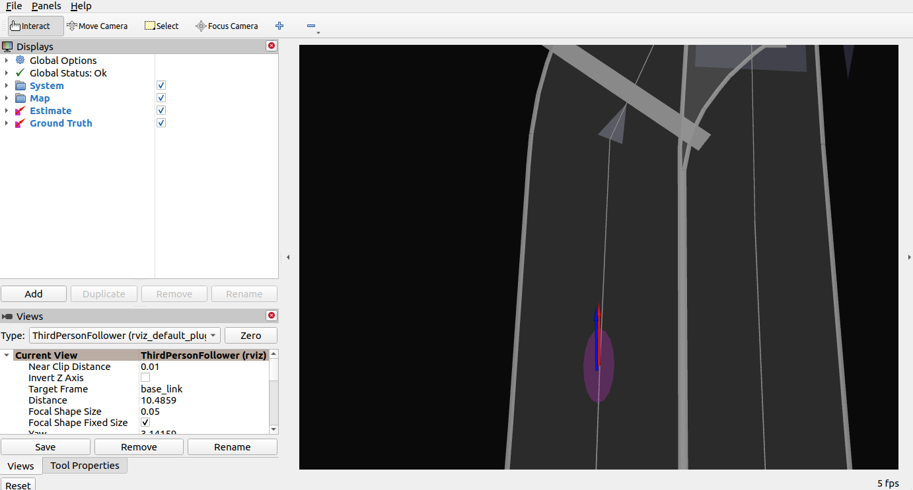
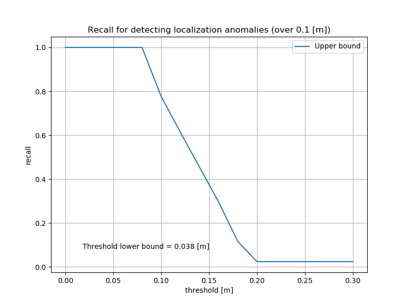

# deviation_estimation_tools

## 1. How to use the tools

This repository consists of two main tools implemented on ROS2.

1. Deviation Estimator
2. Deviation Evaluator

### A. Estimation step

Here you estimate the following parameters using `deviation_estimator`.

- the standard deviation of velocity
- the standard deviation of yaw rate

Launch the node with the following command. Make sure you set the correct parameters (see Sec. 2).

```sh
ros2 launch deviation_estimator deviation_estimator.launch.xml
ros2 bag play YOUR_BAG.db3
```

Then, you need to run either ROS bag or node(s) to provide `pose` and `twist` to `deviation_estimator`.
You can check the estimated results either by looking at the output of `/estimated_*` ROS topics, or a text file saved in the designated path (default: `/home/$(env USER)/output.txt`).

### B. Evaluation step

Here you can evaluate the estimated standard deviation and bias using a package `deviation_evaluator`.
As well as the previous section, run the node with the following command:

```sh
ros2 launch deviation_evaluator deviation_evaluator.launch.xml map_path:=MAP_PATH stddev_vx:=VAL1 stddev_wz:=VAL2 coef_vx:=VAL3 bias_wz:=VAL4
ros2 bag play YOUR_BAG
```

Note that you need to specify the parameters (`stddev_vx:=VAL1 stddev_wz:=VAL2 coef_vx:=VAL3 bias_wz:=VAL4`) you want to evaluate, for example, the results written in `output.txt`.

After it's done, run the following command to generate the final results in `/home/$USER/deviation_evaluator_sample`.

```sh
pip3 install -r requirements.txt
python3 PATH/TO/scripts/additional_evaluator.py /home/$USER/deviation_evaluator_sample
```

Done!

## 2. Description of Deviation Estimator

### Overview

The **Deviation Estimator** estimates the standard deviation and bias for velocity and yaw bias. The estimated parameters can be used in `ekf_localizer` in Autoware.

### Launch

The `deviation_estimator` can be launched with the following command.

```sh
roslaunch deviation_estimator deviation_estimator.launch.xml
ros2 bag play YOUR_BAG
```

The parameters and input topic names can be seen in the `deviation_estimator.launch.xml` file.
`YOUR_BAG` should include all the required inputs written below.

### Inputs / Outputs

#### Input

| Name                                                  | Type                                             | Description           |
| ----------------------------------------------------- | ------------------------------------------------ | --------------------- |
| `/localization/pose_estimator/pose_with_covariance`   | `geometry_msgs::msg::PoseWithCovarianceStamped`  | Input pose (default)  |
| `/localization/pose_estimator/pose`                   | `geometry_msgs::msg::PoseStamped`                | Input pose            |
| `/localization/twist_estimator/twist_with_covariance` | `geometry_msgs::msg::TwistWithCovarianceStamped` | Input twist (default) |
| `/localization/twist_estimator/twist`                 | `geometry_msgs::msg::TwistStamped`               | Input twist           |

#### Output

| Name                   | Type                     | Description                        |
| ---------------------- | ------------------------ | ---------------------------------- |
| `/estimated_stddev_vx` | `std_msgs::msg::Float64` | estimated standard deviation of vx |
| `/estimated_stddev_wz` | `std_msgs::msg::Float64` | estimated standard deviation of vx |
| `/estimated_coef_vx`   | `std_msgs::msg::Float64` | ellipse coef of vx                 |
| `/estimated_bias_wz`   | `std_msgs::msg::Float64` | ellipse bias of wz                 |

### Parameters for deviation estimator

| Name                      | Type   | Description                                                                                 | Default value                  |
| ------------------------- | ------ | ------------------------------------------------------------------------------------------- | ------------------------------ |
| show_debug_info           | bool   | Flag to display debug info                                                                  | true                           |
| use_pose_with_covariance  | bool   | Flag to use PoseWithCovarianceStamped rostopic for pose. Use PoseStamped if false.          | true                           |
| use_twist_with_covariance | bool   | Flag to use TwistWithCovarianceStamped rostopic for pose. Use TwistStamped if false.        | true                           |
| t_design                  | double | Maximum expected duration of dead-reckoning [s]                                             | 10.0                           |
| x_design                  | double | Maximum expected trajectory length of dead-reckoning [m]                                    | 30.0                           |
| estimation_freq           | double | Estimation frequency [Hz]                                                                   | 0.5                            |
| results_path              | string | Text path where the estimated results will be stored (No output if results_path="" (blank)) | "/home/$(env USER)/output.txt" |

### Functions

#### Bias estimation

By assuming that the pose information is a ground truth, the node estimates the bias of velocity and yaw rate.

#### Standard deviation estimation

The node also estimates the standard deviation of velocity and yaw rate. This can be used as a parameter in `ekf_localizer`.
Note that the final estimation takes into account the bias.

## 3. Description of Deviation Evaluator

You can use `deviation_evaluator` for evaluating the estimated standard deviation parameters.
This can be run with the following command:

```sh
ros2 launch deviation_evaluator deviation_evaluator.launch.xml stddev_vx:=VAL1 stddev_wz:=VAL2 coef_vx:=VAL3 bias_wz:=VAL4
ros2 bag play YOUR_BAG
```

`YOUR_BAG` should include all the required inputs written below.  
You need to specify the parameters (`stddev_vx:=VAL1 stddev_wz:=VAL2 coef_vx:=VAL3 bias_wz:=VAL4`) you want to evaluate, for example, the results written in `output.txt`.

All the intermediate ros2bag and config files will be stored in `/home/$USER/deviation_evaluator_sample` (you can change this with `save_dir` parameter in the launch file).

After it is done, run `additional_evaluator.py` to generate the final results.

```sh
pip3 install -r requirements.txt
python3 scripts/additional_evaluator.py /home/$USER/deviation_evaluator_sample
```

### Features

#### A. Visualization of confidence ellipse

`deviation_evaluator` supports rviz visualization. To use this feature, set `rviz:=true` and `map_path:=/path/to/map_folder`.

<p align="left">
    
</p>

<!-- ### B. Analysis on estimated parameters in `deviation_estimator`
`deviation_evaluator` evaluates the parameters estimated in `deviation_estimator`.
The tool stores Mahalanobis distance, and calculates how much of the scores were in X% confidence interval. The scores are stored in `log.txt` in the following format:
```
Confidence interval[%], Actual distribution[%]
50.0, a
75.0, b
95.0, c
```
Make sure that `c>95`. -->

#### B. Materials for determining the threshold

The file `additional_evaluator.py` supports you determining the threshold in `localization_error_monitor`.

In case of determining a threshold along the long radius (`warn_ellipse_size` or `error_ellipse_size`), see `deviation_evaluator_sample/long_radius`.  
In case of determining a threshold along the lateral direction of the body frame ( `warn_ellipse_size_lateral_direction` or `error_ellipse_size_lateral_direction`), see `deviation_evaluator_sample/body_frame`.

In the directory, you can find a threshold-recall plot for each error threshold (see the below example figure).
The blue line in the plot shows the relationship between recall and threshold. If the recall is 1, it indicates that you have 0.0 [%] of false negative.
You can also find the lower bound of the threshold in the plot. Choose a proper threshold so that

1. **it is above the lower bound** (in the sample, it is 0.038 [m])
2. **recall is high enough** (in the sample, recall will be 1.0 if you choose 0.05[m])

<p align="left">
    
</p>

### Inputs / Outputs

#### Input

| Name                                                     | Type                                             | Description                                                     |
| -------------------------------------------------------- | ------------------------------------------------ | --------------------------------------------------------------- |
| `/localization/twist_estimator/twist_with_covariance`    | `geometry_msgs::msg::TwistWithCovarianceStamped` | Input twist                                                     |
| `/localization/pose_estimator/pose_with_covariance`      | `geometry_msgs::msg::PoseWithCovarianceStamped`  | Input pose                                                      |
| `/localization/pose_twist_fusion_filter/kinematic_state` | `nav_msgs::msg::Odometry`                        | Input odometry (recorded with `ros2 bag record` in launch file) |

#### Output

| Name                                                                      | Type                                             | Description                        |
| ------------------------------------------------------------------------- | ------------------------------------------------ | ---------------------------------- |
| `/localization/deviation_evaluator/twist_estimator/twist_with_covariance` | `geometry_msgs::msg::TwistWithCovarianceStamped` | Output twist (for `ekf_localizer`) |
| `/localization/deviation_evaluator/pose_estimator/pose_with_covariance`   | `geometry_msgs::msg::PoseWithCovarianceStamped`  | Output pose (for `ekf_localizer`)  |

### Parameters for deviation evaluator

| Name      | Type       | Description                                                                | Default value                                  |
| --------- | ---------- | -------------------------------------------------------------------------- | ---------------------------------------------- |
| rviz      | bool       | Show rviz if true                                                          | false                                          |
| map_path  | string     | Path to the directory where map data (OpenStreetMap or .osm data) is saved | ""                                             |
| save_dir  | string     | Output directory where figures, parameter files, and scores are saved      | "/home/$(env USER)/deviation_evaluator_sample" |
| stddev_vx | double     | Standard deviation of vx                                                   | 0.8                                            |
| stddev_wz | double     | Standard deviation of wz                                                   | 0.01                                           |
| coef_vx   | double     | Velocity bias                                                              | 1                                              |
| bias_wz   | double     | Yaw rate bias                                                              | 0                                              |
| period    | double [s] | Duration of cycle                                                          | 10                                             |
| cut       | double [s] | Duration of ndt-cut-off                                                    | 9                                              |

## 4. Reflect the estimated parameters in Autoware

### Results of Deviation Estimator

- standard deviation of velocity (stddev_vx): the first value of `twist_covariance` in `vehicle_velocity_converter.param.yaml`
- standard deviation of yaw rate (stddev_wz): `angular_velocity_stddev_zz` in `imu_corrector.param.yaml`
- coefficient of velocity (coef_vx): depends on the type of the vehicles
- bias of yaw rate (bias_wz): `angular_velocity_offset_z` in `imu_corrector.param.yaml`

### Results of Deviation Evaluator

- threshold along long radius: `*_ellipse_size` in `localization_error_monitor`
- threshold along lateral direction of the body frame: `*_ellipse_size_lateral_direction` in `localization_error_monitor`

## 5. Known issues

- The plot of `deviation_evaluator.png` generated by `additional_evaluator.py` may diverge, possibly due to the large covariance caused by a failure in localization.
