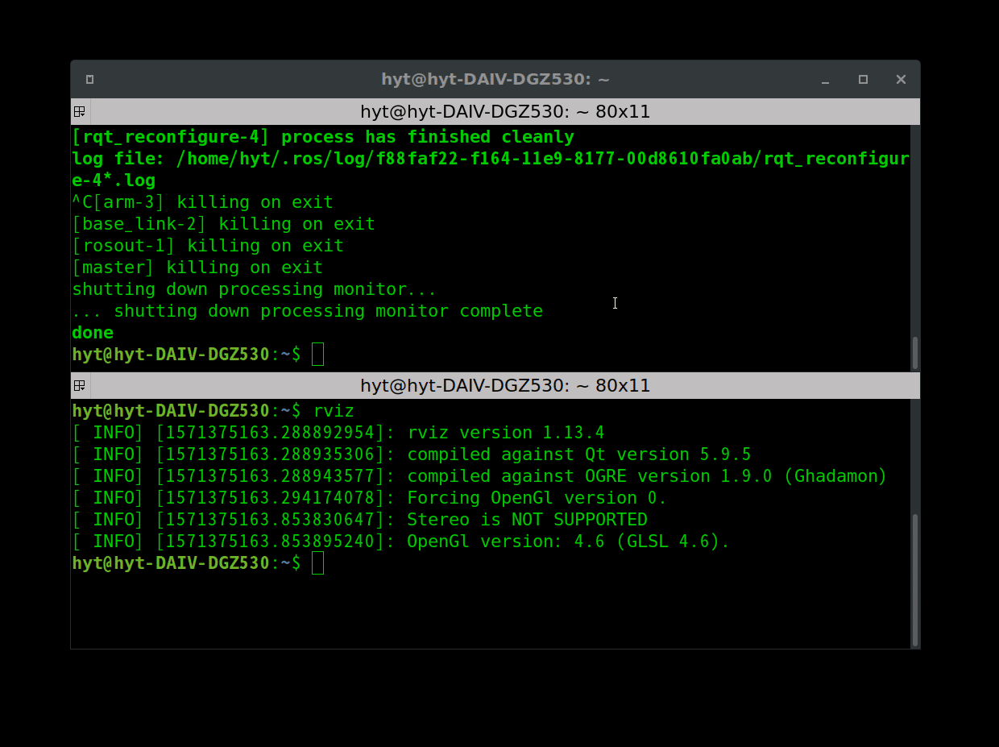
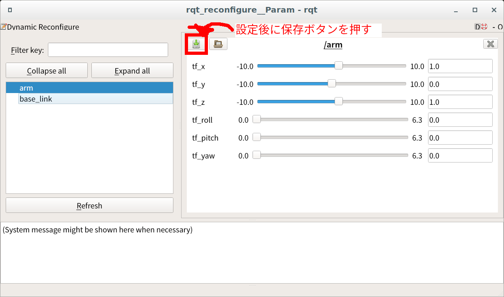

# Tunable static tf broadcaster

rqt_reconfigure を用いて、GUI で tf2 の x, y, z, roll, pitch, yaw を変更して broadcast するノード



## quick start

```sh
ros2 launch tunable_static_tf_broadcaster sample.launch.xml
```

## tf のフレームの増やし方

tunable_static_tf_broadcaster_node を複数立ち上げることでフレームを増やせます。

1. sample.launch.xml をコピーして適当な名前をつける
2. 以下のノードのブロックを追加していく

```xml
  <!-- 追加するノード -->
  <node name="ノード名" pkg="tunable_static_tf_broadcaster" exec="tunable_static_tf_broadcaster_node.py" >
    <param name="rate" value="10.0" type="double" /> <!-- tfの更新レート[Hz]-->
    <param name="header_frame" value="親フレームのID" type="string" /> <!-- tfのヘッダフレームID -->
    <param name="child_frame" value="子のフレームID" type="string" /> <!-- tfの子フレームID-->
    <param from="$(find-pkg-share tunable_static_tf_broadcaster)/params/初期化に使うyaml" /> <!-- 初期化用yaml -->
  </node>
```

## rqt_reconfigure で設定したパラメータをロードする方法

1. rqt_reconfigure で適切なパラメータを設定し、GUI から yaml を保存する

   

2. 保存した yaml を上記の初期化用 yaml で指定して起動時にロードするように設定する。
