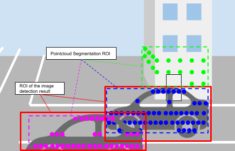

# roi_cluster_fusion

## Purpose

roi_cluster_fusion is a package for filtering clusters that are less likely to be objects and overwriting labels of clusters with that of Region Of Interests (ROIs) by a 2D object detector.

## Inner-workings / Algorithms

The clusters are projected onto image planes, and then if the ROIs of clusters and ROIs by a detector are overlapped, the labels of clusters are overwritten with that of ROIs by detector. Intersection over Union (IoU) is used to determine if there are overlaps between them.

## Inputs / Outputs

### Input

| Name                  | Type                                                     | Description                                                                        |
| --------------------- | -------------------------------------------------------- | ---------------------------------------------------------------------------------- |
| `clusters`            | `tier4_perception_msgs::msg::DetectedObjectsWithFeature` | clustered pointcloud                                                               |
| `input/camera_infoID` | `sensor_msgs::msg::CameraInfo`                           | camera information to project 3d points onto image planes, `ID` is between 0 and 7 |
| `input/roisID`        | `tier4_perception_msgs::msg::DetectedObjectsWithFeature` | ROIs from each image, `ID` is between 0 and 7                                      |
| `input/image_rawID`   | `sensor_msgs::msg::Image`                                | images for visualization, `ID` is between 0 and 7                                  |

### Output

| Name                 | Type                      | Description                                       |
| -------------------- | ------------------------- | ------------------------------------------------- |
| `output/image_rawID` | `sensor_msgs::msg::Image` | images for visualization, `ID` is between 0 and 7 |

## Parameters

### Core Parameters

| Name                        | Type  | Description                                                                   |
| --------------------------- | ----- | ----------------------------------------------------------------------------- |
| `use_iou_x`                 | bool  | calculate IoU only along x-axis                                               |
| `use_iou_y`                 | bool  | calculate IoU only along y-axis                                               |
| `use_iou`                   | bool  | calculate IoU both along x-axis and y-axis                                    |
| `use_cluster_semantic_type` | bool  | if `false`, the labels of clusters are overwritten by `UNKNOWN` before fusion |
| `iou_threshold`             | float | the IoU threshold to overwrite a label of clusters with a label of roi        |
| `rois_number`               | int   | the number of input rois                                                      |

## Assumptions / Known limits

<!-- Write assumptions and limitations of your implementation.

Example:
  This algorithm assumes obstacles are not moving, so if they rapidly move after the vehicle started to avoid them, it might collide with them.
  Also, this algorithm doesn't care about blind spots. In general, since too close obstacles aren't visible due to the sensing performance limit, please take enough margin to obstacles.
-->

## (Optional) Error detection and handling

<!-- Write how to detect errors and how to recover from them.

Example:
  This package can handle up to 20 obstacles. If more obstacles found, this node will give up and raise diagnostic errors.
-->

## (Optional) Performance characterization

<!-- Write performance information like complexity. If it wouldn't be the bottleneck, not necessary.

Example:
  ### Complexity

  This algorithm is O(N).

  ### Processing time

  ...
-->

## (Optional) References/External links

<!-- Write links you referred to when you implemented.

Example:
  [1] {link_to_a_thesis}
  [2] {link_to_an_issue}
-->

## (Optional) Future extensions / Unimplemented parts

<!-- Write future extensions of this package.

Example:
  Currently, this package can't handle the chattering obstacles well. We plan to add some probabilistic filters in the perception layer to improve it.
  Also, there are some parameters that should be global(e.g. vehicle size, max steering, etc.). These will be refactored and defined as global parameters so that we can share the same parameters between different nodes.
-->
